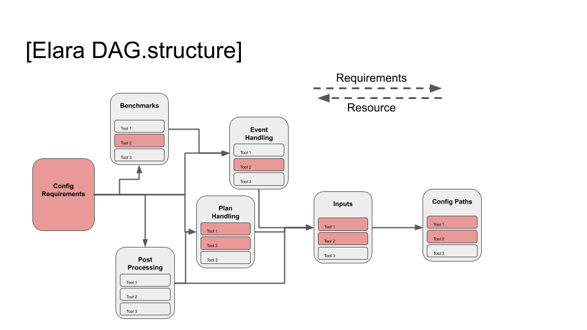
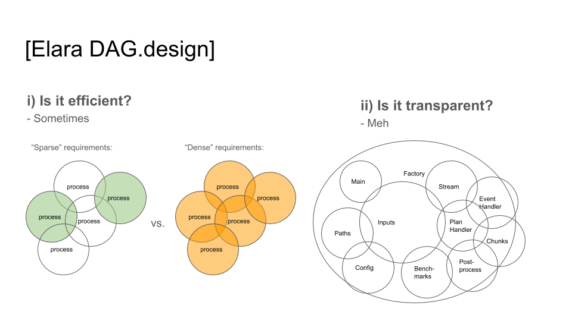

# Elara

A command line utility for processing MATSim output XML files:

* **Event Based Outputs** (for example transport network 'flows' or agent waiting times)
* **Plan Based Outputs** (for example mode shares or final agent plan records)
* **Post Processing** of Outputs (for example for vehicle kms)
* **Benchmarking** of Outputs (for example comparison to measured cordon counts)

## Contents
* [Installation](#markdown-header-installation)
* [Tests](#markdown-header-tests)
* [About](#markdown-header-about)
* [Command line reference](#markdown-header-command-line-reference)
* [Configuration format](#markdown-header-configuration-format)
* [Adding features](#markdown-header-adding-features)
* [Todo](#markdown-header-todo)
* [What does the name mean?](#markdown-header-what-does-the-name-mean)

## Installation
Clone or download the repository from the [downloads section](https://bitbucket.org/arupdigital/elara/downloads/). Once available locally, navigate to the folder and run:
```
pip3 install -e .
elara --help
```

The ``GeoPandas`` library requires ``pyproj`` as a dependency. This can be a bit of a pain to install. For Mac OSX, activate the environment Elara lives in and run the following commands before installing the tool:
```
pip3 install cython
pip3 install git+https://github.com/jswhit/pyproj.git
```

On Windows, pre-compiled wheels of ``pyproj`` can be found on [this page](https://www.lfd.uci.edu/~gohlke/pythonlibs/). Manually install the correct ``pyproj`` wheel within your environment using pip.  

We require pyproj=='2.4.0' because older version have proven to be very slow/hang for converting 
between coordinate reference systems.

## Tests


### Run the tests (from root dir)

    python -m pytest -vv tests

### Generate a code coverage report

To generate XML & HTML coverage reports to `reports/coverage`:

    ./scripts/code-coverage.sh
    
### Debug

Logging level can be set in the config, or otherwise defaults to False (INFO). We currently 
support the following levels: DEBUG, INFO, WARN/WARNING

Note that the configured or default logging level can be overwritten using an env variable:

    export ELARA_LOGGINGLEVEL='True'


## About
Elara is designed to undertake arbitrarily complex pipelines of output processing, postprocessing
 and benchmarking as defined by a configuration file, such as `elara.scenario.toml`.
 
Elara defines a graph of connected `WorkStations`, each responsible for building certain types of
 output or intermediate data requirements (`Tools`). These workstations are connected to their 
 respective 
 dependees and dependencies (managers and suppliers) to form a DAG.
 
Elara uses this DAG to provide:

* **Minimal** dependency processing
* **Early validation** of all intermediate requirements 
* **Early Failure**/Ordering

Elara does this by traversing the DAG in three stages:

1) Longest path search to ensure correct order.

2) Breadth first initiation of `.tools` as `.resources` and supplier validation.

3) Reverse Breadth first build all tools in `.resources` and build workstation.



## Command line reference
```
Usage: elara [OPTIONS] CONFIG_PATH

  Command line tool for processing a MATSim
  scenario events output. :param config_path:
  Configuration file path

Options:
  -h, --help  Show this message and exit.
  -o, --path_overrides string representation of a dictionary mapping a set of input paths, and/our output 'path' to overrides


Example:
  elara tests/test_xml_scenario.toml

  elara -o "{'events': 'some_event_path'}" tests/test_xml_scenario
```

Given the path to a suitable configuration TOML file (see [here](#markdown-header-configuration-format)), processes a MATSim events file and produces the desired
 summary metric files. For example: `elara scenario.toml`.

## Configuration format
This utility uses a TOML configuration format to specify input, output and metric generation options. For example:
```
 [scenario]
name = "test_town"
time_periods = 24
scale_factor = 0.01
crs = "EPSG:27700"
verbose = INFO

[inputs]
events = "./tests/test_fixtures/output_events.xml"
network = "./tests/test_fixtures/output_network.xml"
transit_schedule = "./tests/test_fixtures/output_transitSchedule.xml"
transit_vehicles = "./tests/test_fixtures/output_transitVehicles.xml"
attributes = "./tests/test_fixtures/output_personAttributes.xml"
plans= "./tests/test_fixtures/output_plans.xml"

[event_handlers]
volume_counts = ["car"]
passenger_counts = ["bus", "train"]
stop_interactions = ["bus", "train"]
waiting_times = ["all"]

[plan_handlers]
mode_share = ["all"]
agent_logs = ["all"]
highway_distances = ["car"]

[post_processors]
vkt = ["car"]

[benchmarks]
test_town_cordon = ["car"]

[outputs]
path = "./tests/test_outputs"
contract = true
```

The following fields are available:

**#** scenario.**name** *string* *(required)*

The name of the scenario being processed, using when naming output files.

**#** scenario.**time_periods** *integer* *(required)*

The number of time slices used to split a 24-hour period for the purposes of reporting. A value of ``24`` will produce summary metrics for each our of the day. Similarly, a value of ``96`` will produce 15-minute summaries.

**#** scenario.**scale_factor** *float* *(required)*

The sample size used in the originating MATSim scenario run. This is used to scale metrics such as volume counts. For example, if the underlying scenario was run with a 25% sample size, a value of ``0.25`` in this field will ensure that all calculated volume counts are scaled by 4 times.

**#** scenario.**crs** *string* *(required)*

The EPSG code specifying which coordinate projection system the MATSim scenario inputs used. This
 is used to convert the results to WGS 84 as required. 

**#** inputs.**events** *file*

Path to the MATSim events XML file. Can be absolute or relative to the invocation location.

**#** inputs.**network** *file*

Path to the MATSim network XML file. Can be absolute or relative to the invocation location.

**#** inputs.**etc** *file*

Path to additional MATSim resources.

**#** event_handlers.**[handler name]** *list of strings* *(optional)*

Specification of the event handlers to be run during processing. Currently available handlers include:

* ``volume_counts``: Produce link volume counts and volume capacity ratios by time slice.
* ``passenger_counts``: Produce vehicle occupancy by time slice.
* ``stop_interactions``: Boardings and Alightings by time slice.
* ``waiting_times``: Agent waiting times for unique pt interaction events.

The associated list attached to each handler allows specification of which options (typically modes
 of transport) should be processed using that handler. This allows certain handlers to be activated 
for public transport modes but not private vehicles for example. Possible modes currently include:

* eg ``car, bus, train, tram, ferry, ...``.
* note that ``waiting_times`` only supports the option of ``["all"]``.

**#** plan_handlers.**[handler name]** *list of strings* *(optional)*

Specification of the plan handlers to be run during processing. Currently available handlers 
include:

* ``mode_share``: Produce global modeshare of final plans using a mode hierarchy.
* ``agent_logs``: Produce flat output of agent activity logs and leg logs, including times, 
sequences, durations and categories.
* ``agent_plans``: Produce flat output of agent plans (logs and activities) including unselected 
plans and scores, 
including times, 
sequences, durations and categories.
* ``highway_distances``: Produce flat output of agent distances by car on different road 
types (as described by the input network osm:way).

The associated list attached to each handler allows specification of additional options:

* in most cases ``all``
* agent_plans support subpopulation selection, eg ``rich, poor``
* highway_distances only supports ``car``

**#** post_processors.**[post-processor name]** *list of strings* *(optional)*

Specification of the event handlers to be run post processing. Currently available handlers include:

* ``vkt``: Produce link volume vehicle kms by time slice.
* ``trip_logs``: Produce record of all agent trips using mode hierarchy to reveal mode of trips 
with multiple leg modes.

The associated list attached to each handler allows specification of which modes of transport should be processed using that handler. This allows certain handlers to be activated for public transport modes but not private vehicles for example. Possible modes currently include:

* eg ``car, bus, train, ...``
* note that ``trip_logs`` only supports the option of ``["all"]``.

**#** benchmarks.**[benchmarks name]** *list of strings* *(optional)*

Specification of the benchmarks to be run. These include a variety of highway counters, 
cordons and mode share benchmarks for specific projects. Currently available 
benchmarks include:

* ``test_town_highways``
* ``squeeze_town_highways``
* ``ireland_highways``
* ``london_inner_cordon_car``
* ``dublin_canal_cordon_car``
* ``ireland_commuter_modeshare``
* ``test_town_cordon``
* ``test_town_peak_cordon``
* ``test_town_modeshare``

The associated list attached to each handler allows specification of which modes of transport should be processed using that handler. This allows certain handlers to be activated for public transport modes but not private vehicles for example. Possible modes currently include:

* eg ``car, bus, train, ...``

**#** outputs.**path** *directory* *(required)*

Desired output directory. Can be absolute or relative to the invocation location. If the directory does not exist it will be created.

**#** outputs.**contract** *boolean*

If set to *true*, removes rows containing only zero values from the generated output files. 

## Adding Features

Elara is designed to be extendable, primarily with new tools such as handlers or benchmarks. 

Where new tools are new classes that implement some process that fits within the implementation 
(both in terms of code and also abstractly) of a WorkStation. New tools must be added to the 
relevant workstations 'roster' of tools (ie `.tools`).

New tool classes must correctly inherit and implement a number of values and methods so that they 
play well with their respective workstation:
 
* ``.__init__(self, config, option)``: Used for early validation of option and 
subsequent requirements.
* ``.build(self, resource=None)``: Used to process required output (assumes required resources are 
available).

`tool_templates` provides some templates and notes for adding new tools.
 
 It may also be required to add or connect new workstations, where new workstations are new types
  of process that might contain a new or multiple new tools. New workstations must be defined and
   connected to their respective suppliers and managers in `main`.

## Todo

**Priority**

* Move more process and verbosity into main to make factory process more transparent.
* Unit testing.

**Nice to have**

* More descriptive generated column headers in handler results. Right now column headers are simply numbers mapped to the particular time slice during the modelled day. 
* More outputs, ie mode distances/times/animations.
* S3 integration (read and write).
* automatic discovery of inputs in directory.

**Is it fast/sensible?**

 Sometimes - 
 
 

## What does the name mean?
[Elara]("https://en.wikipedia.org/wiki/Elara_(moon)") is a moon of Jupiter. There's not much else interesting to say about it, other than that the wikipedia article states that it orbits 11-13 *gigametres* from the planet. Gigametres is a cool unit of measurement. 
